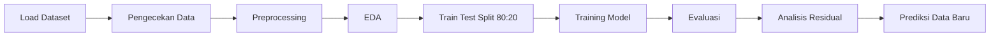
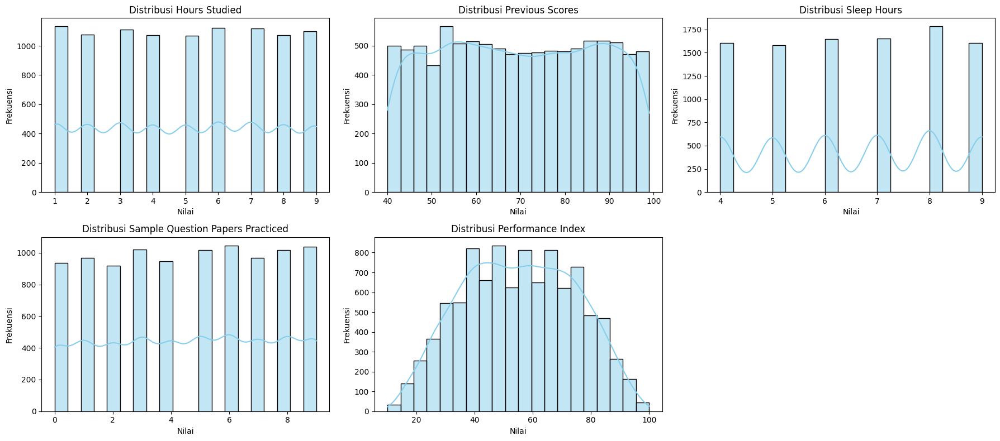
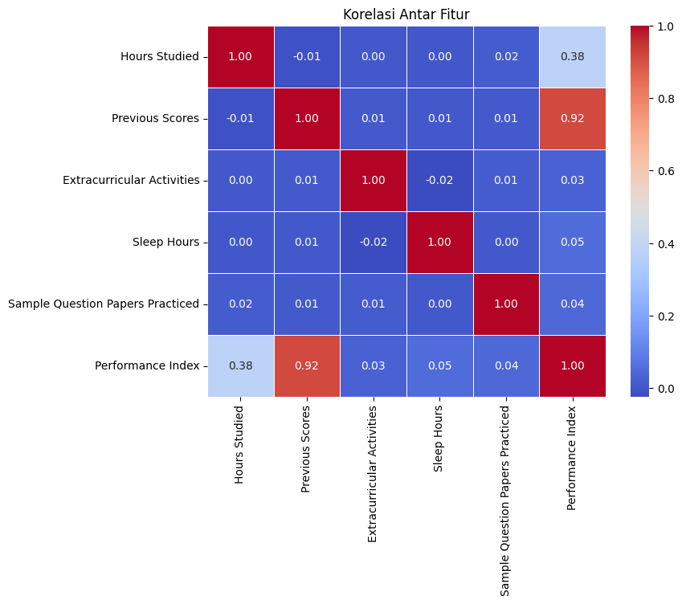
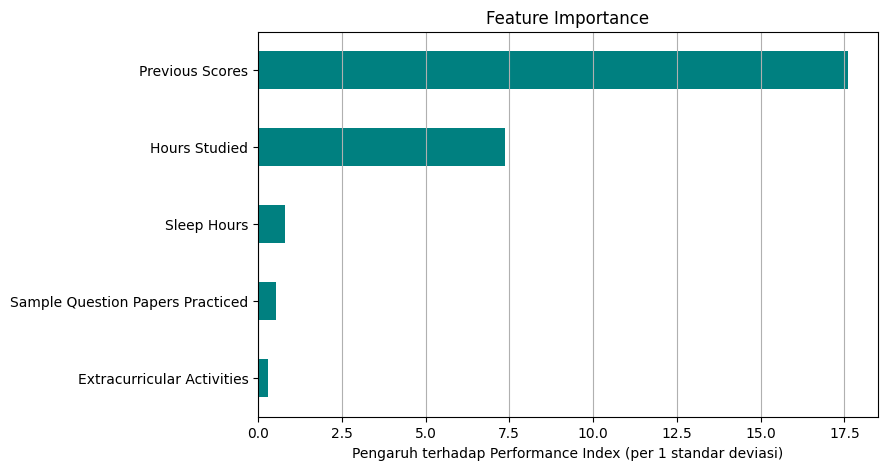
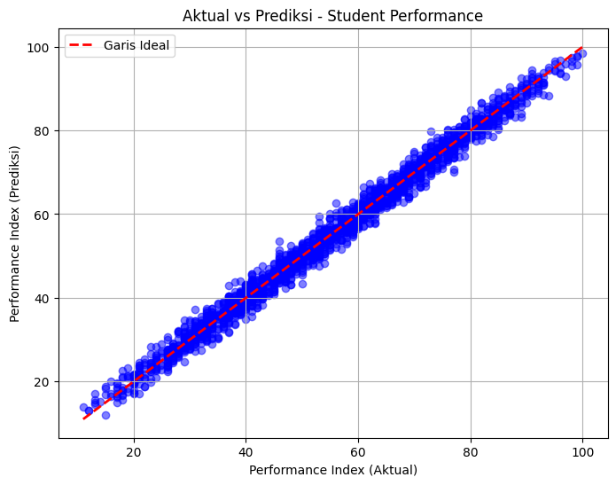
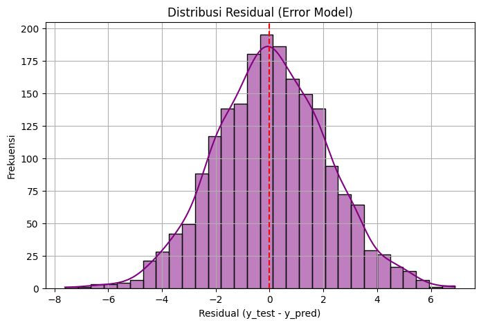
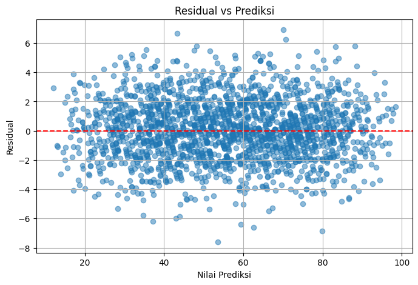

<div align="center">

# 🎓 Prediksi Student Performance Index dengan Linear Regression

**Memprediksi performa akademik siswa berdasarkan kebiasaan belajar menggunakan Multiple Linear Regression**

[](https://colab.research.google.com/github/RafaEnricoo/machine-learning/blob/main/linear-regression-student-performance/Student%20Performance%20Index_Linear%20Regression.ipynb)


Tugas Mata Kuliah **Pembelajaran Mesin** · Teknologi Rekayasa Komputer · Politeknik Negeri Semarang

</div>

---

## 📑 Daftar Isi
- [Ringkasan](#-ringkasan)
- [Dataset](#-dataset)
- [Alur Pengerjaan](#-alur-pengerjaan)
- [Exploratory Data Analysis](#-exploratory-data-analysis)
- [Model](#-model)
- [Hasil Evaluasi](#-hasil-evaluasi)
- [Analisis Residual](#-analisis-residual)
- [Contoh Prediksi](#-contoh-prediksi)
- [Cara Menjalankan](#-cara-menjalankan)
- [Struktur Folder](#-struktur-folder)
- [Kesimpulan](#-kesimpulan)
- [Keterbatasan dan Saran](#-keterbatasan-dan-saran)

---

## 📌 Ringkasan
Proyek ini membangun model **Multiple Linear Regression** untuk memprediksi **Performance Index** siswa berdasarkan lima faktor: jam belajar, nilai sebelumnya, keikutsertaan ekstrakurikuler, jam tidur, dan jumlah latihan soal.

| Hasil Utama | Nilai |
|---|---|
| 🎯 R² (data uji) | **0,9884** |
| 📏 RMSE | **2,08 poin** |
| 📐 MAE | **1,65 poin** |
| 🔁 Rata-rata R² (5-fold CV) | **0,9887** |
| 🏆 Faktor paling berpengaruh | **Previous Scores**, diikuti **Hours Studied** |

> Model mampu menjelaskan **98,84%** variasi Performance Index, dengan rata-rata prediksi meleset hanya sekitar **±2 poin** pada skala 10–100.

---

## 📊 Dataset
Dataset **Student Performance** dari [Kaggle](https://www.kaggle.com/datasets/nikhil7280/student-performance-multiple-linear-regression) berisi **10.000 data siswa**. Setelah 127 baris duplikat dihapus, tersisa **9.873 data**.

| Kolom | Keterangan | Rentang | Peran |
|---|---|---|---|
| Hours Studied | Jumlah jam belajar | 1–9 | Fitur |
| Previous Scores | Nilai ujian sebelumnya | 40–99 | Fitur |
| Extracurricular Activities | Ikut ekstrakurikuler | Yes / No | Fitur |
| Sleep Hours | Rata-rata jam tidur per hari | 4–9 | Fitur |
| Sample Question Papers Practiced | Jumlah latihan soal | 0–9 | Fitur |
| **Performance Index** | Indeks performa siswa | 10–100 | **Target** |

---

## 🔄 Alur Pengerjaan



1. **Pengecekan data:** cek tipe data, statistik deskriptif, missing value (tidak ada), dan duplikat (127 baris dihapus).
2. **Preprocessing:** label encoding kolom Extracurricular Activities (`Yes` → 1, `No` → 0).
3. **EDA:** histogram sebaran data dan correlation matrix.
4. **Split data:** 80% data latih (7.898) dan 20% data uji (1.975), `random_state=42`.
5. **Training:** Linear Regression dengan metode Ordinary Least Squares.
6. **Evaluasi:** R², MSE, RMSE, MAE, pengecekan overfitting, 5-fold cross-validation, dan perbandingan dengan model lain.
7. **Analisis residual:** uji asumsi normalitas, linearitas, dan homoskedastisitas.

---

## 🔍 Exploratory Data Analysis

### Distribusi Data
<p align="center"></p>

Fitur-fitur tersebar relatif merata, sedangkan Performance Index berbentuk menyerupai lonceng dengan sebagian besar nilai di kisaran 35–75. Tidak ada outlier ekstrem.

### Correlation Matrix
<p align="center"></p>

**Previous Scores** berkorelasi sangat kuat dengan Performance Index (**0,92**), diikuti **Hours Studied** (**0,38**). Korelasi antar fitur mendekati 0, sehingga tidak ada multikolinearitas.

---

## 🤖 Model

### Persamaan Regresi

$$
\text{Performance Index} = -33{,}98 + 2{,}851\,x_1 + 1{,}018\,x_2 + 0{,}574\,x_3 + 0{,}472\,x_4 + 0{,}189\,x_5
$$

| Variabel | Fitur | Koefisien | Arti (fitur lain tetap) |
|---|---|---|---|
| $x_1$ | Hours Studied | 2,851 | +1 jam belajar → +2,85 poin |
| $x_2$ | Previous Scores | 1,018 | +1 nilai sebelumnya → +1,02 poin |
| $x_3$ | Extracurricular Activities | 0,574 | Ikut ekstrakurikuler → +0,57 poin |
| $x_4$ | Sleep Hours | 0,472 | +1 jam tidur → +0,47 poin |
| $x_5$ | Sample Question Papers Practiced | 0,189 | +1 latihan soal → +0,19 poin |

### Feature Importance
<p align="center"></p>

Karena skala tiap fitur berbeda, koefisien dikalikan dengan standar deviasi fitur agar bisa dibandingkan secara adil. Hasilnya, **Previous Scores** (±17,6) dan **Hours Studied** (±7,4) jauh lebih berpengaruh dibanding tiga fitur lainnya.

---

## 📈 Hasil Evaluasi

| Metrik | Nilai | Keterangan |
|---|---|---|
| R² | 0,9884 | 98,84% variasi target dapat dijelaskan model |
| MSE | 4,31 | Rata-rata kuadrat error |
| RMSE | 2,08 | Prediksi rata-rata meleset ±2 poin |
| MAE | 1,65 | Rata-rata selisih absolut 1,65 poin |

### Pengecekan Overfitting dan Cross-Validation

| Pengujian | R² |
|---|---|
| Data latih | 0,9887 |
| Data uji | 0,9884 |
| 5-fold CV (per fold) | 0,9888 · 0,9882 · 0,9890 · 0,9891 · 0,9882 |
| 5-fold CV (rata-rata) | 0,9887 |

R² data latih dan data uji hampir identik (selisih 0,0003), dan hasil cross-validation stabil di setiap fold. Artinya model **tidak overfitting**.

### Perbandingan dengan Model Lain

| Model | R² | RMSE |
|---|---|---|
| 🥇 **Linear Regression** | **0,9884** | **2,075** |
| Ridge Regression | 0,9884 | 2,075 |
| Random Forest | 0,9849 | 2,373 |
| Decision Tree | 0,9753 | 3,034 |

Model yang lebih kompleks tidak memberikan hasil yang lebih baik, karena hubungan antara fitur dan target memang bersifat linear.

### Aktual vs Prediksi
<p align="center"></p>

---

## 🧪 Analisis Residual

| Distribusi Residual | Residual vs Prediksi |
|---|---|
|  |  |
| Berbentuk normal dan terpusat di 0 → **asumsi normalitas terpenuhi** | Tersebar acak tanpa pola dengan lebar sebaran yang sama → **asumsi linearitas dan homoskedastisitas terpenuhi** |

---

## 🧮 Contoh Prediksi

| Hours Studied | Previous Scores | Extracurricular | Sleep Hours | Sample Papers | **Prediksi** |
|---|---|---|---|---|---|
| 7 | 85 | Ya | 7 | 4 | **77,18** |

---

## ▶️ Cara Menjalankan

**Google Colab (disarankan)**
1. Klik badge **Open in Colab** di bagian atas.
2. Upload file `Student_Performance.csv` ke panel **Files** di Colab.
3. Jalankan **Runtime → Run all**.

**Lokal**
```bash
git clone https://github.com/RafaEnricoo/machine-learning.git
cd machine-learning/linear-regression-student-performance
pip install pandas numpy matplotlib seaborn scikit-learn jupyter
jupyter notebook
```

---

## 📁 Struktur Folder
```
linear-regression-student-performance/
├── README.md
├── Student Performance Index_Linear Regression.ipynb   # notebook analisis dan pemodelan
├── Student_Performance.csv                             # dataset
└── img/                                             # grafik untuk README
```

---

## ✅ Kesimpulan
1. Multiple Linear Regression memprediksi Performance Index dengan **sangat baik** (R² = 0,9884, RMSE = 2,08).
2. Model **stabil dan tidak overfitting**, dibuktikan dengan R² latih vs uji yang hampir sama dan hasil cross-validation yang konsisten.
3. **Previous Scores** dan **Hours Studied** adalah faktor utama yang menentukan performa siswa.
4. Seluruh asumsi Linear Regression (normalitas, linearitas, homoskedastisitas) terpenuhi.
5. Linear Regression mengungguli Decision Tree dan Random Forest, sekaligus paling mudah diinterpretasi.

## ⚠️ Keterbatasan dan Saran
- Model hanya memakai 5 fitur. Faktor lain seperti motivasi, kondisi ekonomi, dan lingkungan belajar belum diperhitungkan.
- Dataset memiliki pola yang sangat teratur, sehingga performa pada data siswa nyata kemungkinan lebih rendah.
- Prediksi hanya dapat diandalkan untuk data dalam rentang data latih.
- Ke depannya, model dapat diuji dengan data siswa nyata dan ditambah fitur yang lebih beragam.

---

<div align="center">

**Muhammad Rafa Enrico** · TI-3C · Politeknik Negeri Semarang

</div>
